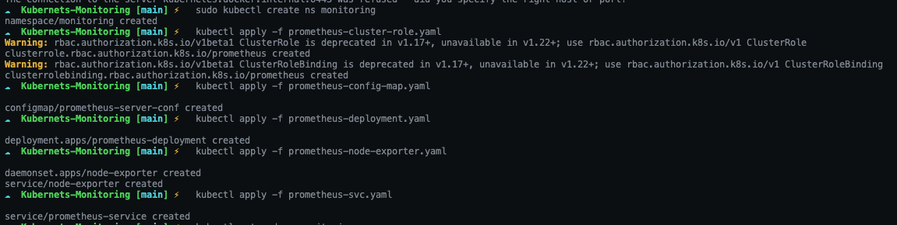

# Kubernetes Monitoring
> This is the Kubernetes monitoring project.   
> Kubernetes + Prometheus + Grafana 
## 🌲 Tree:
- [**main.sh**](./main.sh): I recorded various commands, and also recorded the purpose of the annotation.
- [**prometheus-cluster-role.yaml**](./prometheus-cluster-role.yaml):A file that sets up ClusterRole and binds ClusterRole to give Prometheus containers access to the Kubernetis API.   
***The created ClusterRole works with the default service account in Monitoring Namespace to grant permissions.***
- [**prometheus-config-map.yaml**](./prometheus-config-map.yaml): The configuration file is required for the prometheus to start up, which defines the configuration file.

## 🍦 Create
```shell
# Please create a namespace in Kubernetes using kuberctl.
$ kubectl create ns monitoring

# Kubernetes Devleopment Command
$ kubectl apply -f prometheus-cluster-role.yaml
$ kubectl apply -f prometheus-config-map.yaml
$ kubectl apply -f prometheus-deployment.yaml
$ kubectl apply -f prometheus-node-exporter.yaml
$ kubectl apply -f prometheus-svc.yaml
```

You have executed a command to proceed with the setup for the file introduced above.   
You have set it up for Prometheus and Prometheus Node Exporter.
